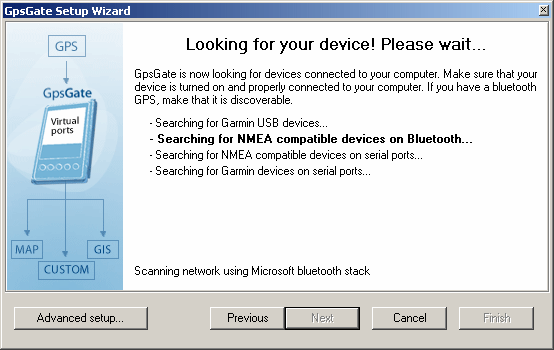
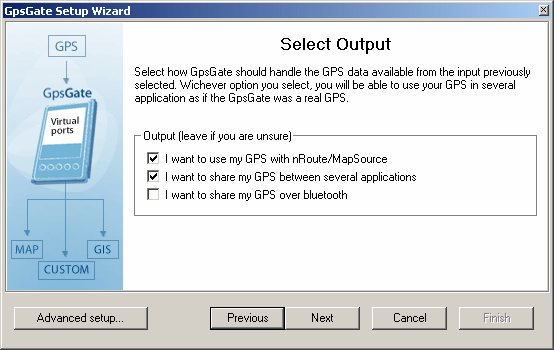

# GpsGate 

## Esegui GpsGate 

È possibile lanciare GpsGate sotto *Start&rarr;Programmi&rarr;KADAS&rarr;GpsGate*.

La prima volta che GpsGate viene eseguito un setup Wizard si avvierà. Il Wizard vi aiuterà a trovare il vostro GPS e vi dirà come collegare le vostre applicazioni GPS a GpsGate.

## Esecuzione dell'installazione guidata .

Assicurati di attivare il tuo GPS e di collegarlo al computer, se si tratta di un GPS Bluetooth senza fili semplicemente attivarlo. Per accelerare la ricerca è possibile deselezionare i tipi di ricevitori GPS che non si desidera cercare. In caso di dubbi, tenere selezionate tutte le opzioni. Dopo aver fatto questo, fare clic su "Avanti" e la procedura guidata analizzerà il computer alla ricerca di un GPS collegato.

Se si è un utente avanzato, fare clic su "Impostazioni avanzate....." per un processo di configurazione in cui si ha il controllo completo. È sempre possibile eseguire nuovamente la procedura guidata dalla finestra di dialogo Impostazioni.

Fare clic su Avanti. La procedura guidata inizierà ora la ricerca di un GPS. Questo può richiedere un po' di tempo.

Quando la procedura guidata trova un GPS, viene visualizzata una finestra di dialogo con un messaggio. Fare clic su "Sì" per accettare il GPS trovato come input. Se hai più ricevitori GPS collegati, clicca su "No" finché GpsGate non trova il ricevitore che vuoi usare.

Se GpsGate non trova il tuo GPS, devi usare "Configurazione avanzata....."

Selezionare Output e fare clic su "Avanti". Se non siete sicuri, cliccate semplicemente su "Avanti".

Nella schermata successiva viene visualizzato un riepilogo. È importante salvare questo riepilogo. È possibile salvarlo in un file e stamparlo. È inoltre possibile trovare queste informazioni in seguito nella finestra di dialogo Impostazioni (dal menu Vassoio).

È possibile collegare applicazioni Garmin come nRoute alla prima porta dell'elenco e altre applicazioni NMEA alle altre porte rimanenti. È possibile collegare una sola applicazione a una porta alla volta. Se è necessario creare più porte, è possibile farlo in qualsiasi momento dalla finestra di dialogo Impostazioni.

Ora è possibile avviare le applicazioni GPS e collegarle alle porte create da GpsGate nell'ultimo passo precedente. Puoi eseguire tutte le applicazioni GPS contemporaneamente!

Quando GpsGate è in esecuzione viene visualizzato come icona Tray. Cliccando su questa icona è possibile accedere alle sue funzioni.

È possibile eseguire nuovamente la procedura guidata in qualsiasi momento selezionando "Installazione guidata...." nella finestra di dialogo Impostazioni. Colori e forme dell'icona del vassoio

L'icona della barra delle applicazioni indica sempre lo stato di GpsGate. Ecco un elenco delle possibili icone della barra delle applicazioni visualizzate:

Nessun dato GPS o NMEA viene rilevato da GpsGate.

I dati GPS validi sono stati rilevati all'ingresso selezionato, ma i dati GPS non hanno alcuna correzione, cioè non possono determinare la sua posizione (ancora).

All'ingresso selezionato è stata rilevata una posizione GPS valida (fix).

Se l'icona del vassoio non è verde, l'applicazione GPS non visualizzerà/utilizzerà una posizione corretta.
