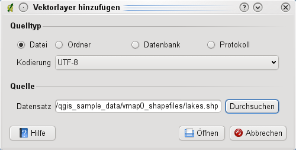

# Formati supportati {#supported-data-formats}

KADAS usa la libreria OGR per leggere e creare vettori, inclusi i formati ESRI shapefile, MapInfo e MicroStation, AutoCAD DXF, PostGIS, SpatiaLite, database Oracle Spatial e MSSQL, e molti altri ancora. Il supporto ai vettori GRASS e a PostgreSQL è fornito da plugin nativi. I vettori possono anche essere caricati in modalità lettura da archivi zip e gzip. Attualmente la libreria OGR supporta 69 formati di vettori (vedi OGR-SOFTWARE-SUITE in *literature\_and\_web*). La lista completa è diponibile all’indirizzo <a href="http://www.gdal.org/ogr/ogr_formats.html" class="uri" class="reference external">http://www.gdal.org/ogr/ogr_formats.html</a>.

## Shapefile ESRI {#esri-shapefiles}

Il formato di file predefinito in KADAS è ESRI shapefile. Il supporto al formato è fornito dalla libreria OGR Simple Feature Library (<a href="http://www.gdal.org/ogr/" class="uri" class="reference external">http://www.gdal.org/ogr/</a>).

Uno shapefile è costituito da di un minimo di tre file:

1.  `.shp` contente le geometrie

2.  `.dbf` contenente gli attributi in formato dBase

3.  `.shx` contenente l’indice

Uno shapefile può anche includere un file con suffisso `.prj` che contiene le informazioni sulla proiezione. Anche se non è obbligatorio, è molto utile avere informazioni sulla proiezione del file. Un insieme di dati shapefile può contenere anche altri tipi di file. Per ulteriori informazioni, vedi le specifiche tecniche di ESRI all’indirizzo <a href="http://www.esri.com/library/whitepapers/pdfs/shapefile.pdf" class="uri" class="reference external">http://www.esri.com/library/whitepapers/pdfs/shapefile.pdf</a>.

### Caricare uno shapefile {#loading-a-shapefile}

When loading a vector layer, the following dialog opens:

**Figure Vector 1:**

Finestra di dialogo aggiungi vettore 

Nella finestra di dialogo seleziona  *File* e clicca su **\[Sfoglia\]**. Si aprirà cosi una finestra di dialogo standard (vedi <a href="#figure-vector-2" class="reference internal">figure_vector_2</a>) che ti consentirà di cercare nel computer lo shapefile o qualunque altro dato vettoriale che vuoi caricare. La casella di controllo *Tipo file*  consente di selezionare in anticipo specifici formati supportati da OGR.

Se vuoi, puoi selezionare il tipo di codifica per lo shapefile.

**Figure Vector 2:**

Finestra di dialogo apri vettore OGR 

Selecting a shapefile from the list and clicking **\[Open\]** loads it into KADAS.

Suggerimento

**Colori dei vettori**

Quando aggiungi un vettore alla mappa, gli viene assegnato un colore casuale. Se aggiungi più vettori in una sola volta, ciascuno avrà un colore diverso.

Una volta caricato lo shapefile, puoi interagire con la mappa usando gli strumenti di navigazione. Per cambiare lo stile di un vettore, apri la finestra di dialogo *Proprietà layer* facendo doppio click sul nome del vettore oppure cliccando con il tasto destro sul nome del vettore e scegliendo *Proprietà*. Vedi la sezione <a href="vector_properties.html#vector-style-menu" class="reference internal"><em>Menu Stile</em></a> per ulteriori informazioni su come impostare la simbologia dei vettori.

### Ottimizzare le prestazioni per gli shapefile {#improving-performance-for-shapefiles}

Per migliorare le prestazioni di visualizzazione di uno shapefile, puoi creare un indice spaziale. L’indice spaziale migliora la velocità di visualizzazione quando usi le funzioni di zoom e di spostamento. Gli indici spaziali usati da KADAS hanno estensione `.qix`.

Segui questi passi per creare un indice spaziale:

-   Carica uno shapefile cliccando sul pulsante  Aggiungi\\ vettore oppure premi `Ctrl+Shift+V`.

-   Apri la finestra di dialogo *Proprietà layer* facendo doppio click sul nome dello shapefile nella legenda o cliccandoci con il tasto destro e scegliendo *Proprietà* dal menu contestuale.

-   Nella scheda *Generale* clicca sul pulsante **\[Crea indice spaziale\]**.

### Problemi nel caricare un file .prj {#problem-loading-a-shape-prj-file}

Se carichi uno shapefile con file `.prj` associato e KADAS non riesce a leggere le informazioni della proiezione, devi inserire manualmente queste informazioni nella scheda *Generale* della finestra di dialogo *Proprietà layer* cliccando su **\[Specifica...\]**. Questo è dovuto al fatto che spesso i file `.prj` non forniscono i parametri di proiezione completi che richiede KADAS e che sono elencati nella finestra di dialogo *SR*.

Per la stessa ragione, quando crei un nuovo shapefile in KADAS, vengono creati due differenti file di proiezione. Un file `.prj` che ha un insieme limitato di parametri compatibili con il software ESRI, e un file `.qpj` che memorizza l’insieme completo dei parametri del SR utilizzato. Quando KADAS trova un file `.qpj` utilizza quest’ultimo invece del file `.prj`.

## Caricare un vettore MapInfo {#loading-a-mapinfo-layer}

 To load a MapInfo layer, change the file type filter *Files of type* : to ‘Mapinfo File \[OGR\] (\*.mif \*.tab \*.MIF \*.TAB)’ and select the MapInfo layer you want to load.

## Caricare una coverage binaria ArcInfo {#loading-an-arcinfo-binary-coverage}

 To load an ArcInfo Binary Coverage, select  *Directory* as *Source type*. Change the file type filter *Files of type*  to ‘Arc/Info Binary Coverage’. Navigate to the directory that contains the coverage file, and select it.

In modo simile puoi caricare vettori nel formato di trasferimento UK National Transfer Format oppure anche nel formato TIGER del US Census Bureau.

