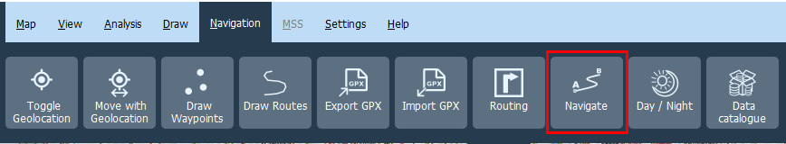
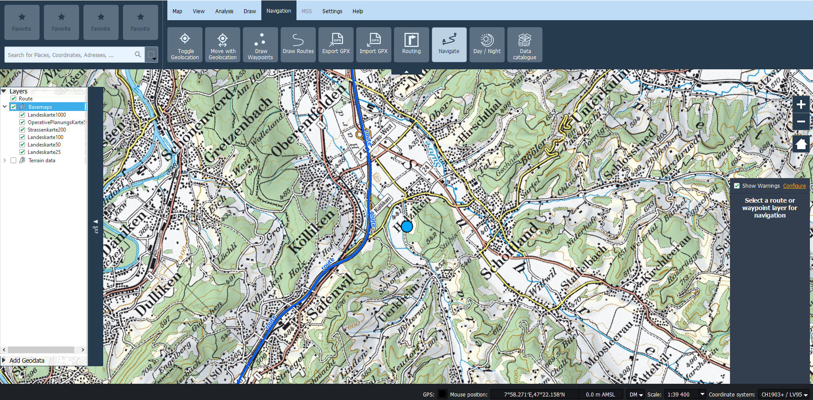
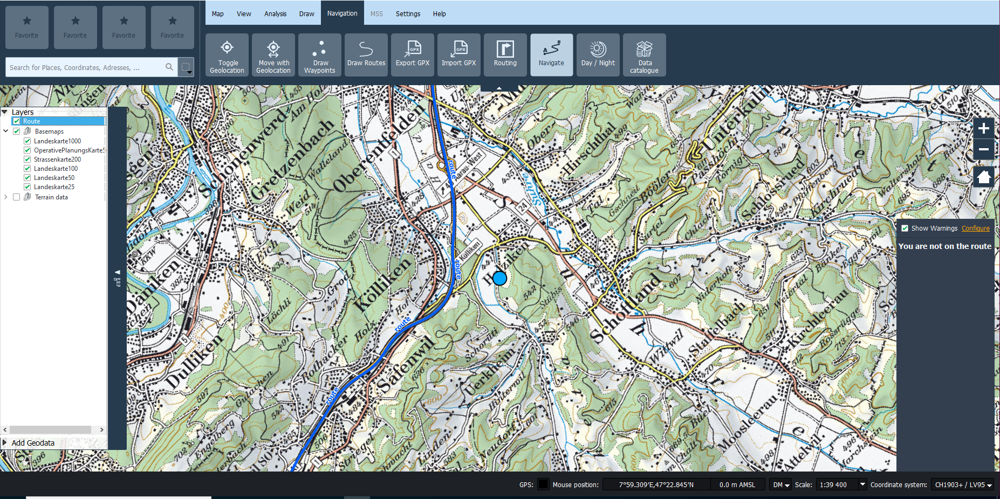
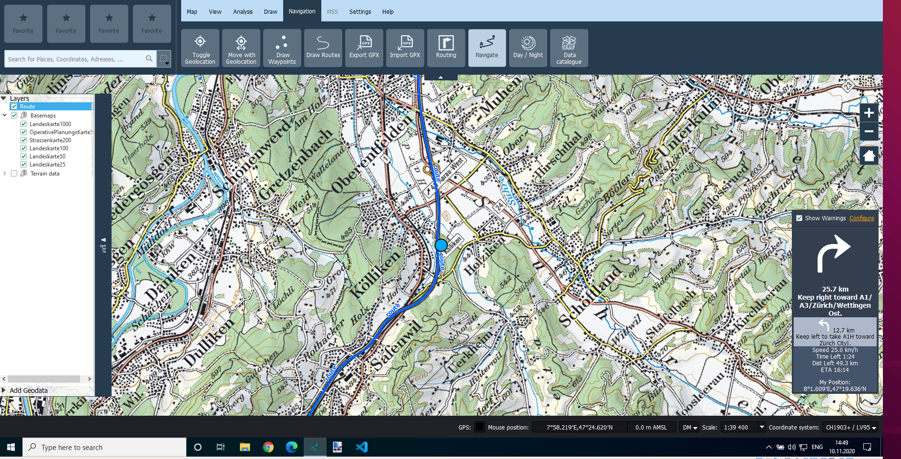
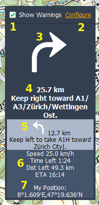
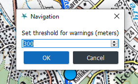

# Routing Plugin


## Installation

These softwares are needed to make the plugin works properly:

1. **KadasLocationSearch**, to enable name-based location search. It is usually shipped with Kadas. Without this, you can still choose a location using GPS or click on the map.
2. **Valhalla**, to enable routing, reachability, and navigation functionality. It must be installed on the same machine. Read more about Valhalla [here](https://github.com/valhalla/valhalla).

Currently, the installation is only available from this repository.

1. Obtaining the source code

    To get the source code, clone this repository:
	```
    git clone http://github.com/camptocamp/kadas-routing-plugin.git
    ```
    or download the source code using the [Github download link button](https://github.com/camptocamp/kadas-routing-plugin/archive/master.zip).

2. Installation

   To install this plugin on [Kadas Albireo 2](https://github.com/kadas-albireo/kadas-albireo2), extract the zip file from step 1, then copy the `kadasrouting` folder to the KADAS plugins folder located in your user folder. For example:
   ```
   C:\Users\fclementi\AppData\Roaming\Kadas\KadasMil\profiles\default\python\plugins
   ```

3. Enable the plugin

   To enable this plugin, open [Plugin Manager](settings.md#sec5) menu from the Settings menu, and tick the checkbox on the Kadas Routing Plugin.

After the plugin has been activated, there will be some additional tool in the Kadas Albiero menu:

1. Routing
2. Navigation
3. Reachability
4. Data Catalogue
5. Day / Night


## Routing

### User Interface

Routing functionality can be accessed from the Navigation Menu.


Clicking the Routing button will open the Routing window like below.


There are some numbers indicated in the image above, below are the explanation for each number:

1. **Layer selector** is used to select the output layer from the routing calculation. If there is already a layer, it will be overridden.
2. **Origin point selector** is used to select the origin point for routing calculation. The user can choose by typing a place name, and a pop up will be shown up where the user can choose based on his typing. The user can also click a location on the map by using the map tool (arrow button) or get the current GPS location (GPS button). A selected point is shown as a pin with an arrow inside it.
3. **Destination point selector** is used to select the destination for routing calculation. The workflow is the same as the *origin point selector.* The selected point is shown as a grey pin with a flag inside it.
4. **Waypoint selector** is used to select a waypoint for routing calculation. The workflow is the same as the *origin point selector*. A waypoint is shown as a grey pin with a circle inside it.
5. **Waypoint add button** is used to add the waypoint from *waypoint selector* to the list of waypoints. All selected waypoints are shown as a yellow circle.
6. **Selected waypoints** is used to show the list of waypoint that has been added by *waypoint add button*
7. **Clear button** is used to clear all selected origin points, destination points, and waypoints.
8. **Reverse button** is used to reverse the origin and destination point. It will also reverse the order of selected waypoints.
9. **Vehicle type selector** is used to choose the type of vehicle for the routing calculation.
10. **Route type selector** is used to choose what kind of route that wants to be calculated. It can be the shortest route or fastest route.
11. **Area to avoid selector** is used to select polygons that will be avoided during the route calculation. It can be created by drawing on the map canvas or from an external polygon layer.
12. **Calculate button** is used to start the routing calculation.
13. **Navigate button** is used to start the navigation based on the calculated route. This button is disabled until a route is calculated.
14. **Close button** is used to close the button

### Route calculation workflow

Here are the steps of the common route calculation workflow:

1. Choose a layer from the *layer selector* combo box. It will overwrite an existing routing layer with the same name. It is also possible to use a different layer by clicking the plus button and setting a new layer name.
2. Choose the origin or starting location by using the *origin point selector*. It can be done by searching the place name, getting the location from a GPS, or clicking on the map by using the map tool (arrow button).
3. Choose the destination location by using the *destination point selector*. It can be done by searching the place name, getting the location from a GPS, or clicking on the map by using the map tool (arrow button).
4. Choose a waypoint candidate by using the *waypoint selector*. A waypoint must be added to the selected waypoint list by using the *waypoint add button*. The selected waypoints are listed on the *selected waypoints* field. Only the waypoints listed here are considered on the routing calculation.
5. If a user wants to clear up all the selected origin, destination, and waypoint; he/she can use the *clear button*.
6. If a user wants to reverse the order of origin point and destination location, he/she can use the *reverse button*.
7. Choose the means of transport. See the [Vehicles](#Vehicles) for more information about the available options.
8. Choose the routing calculation method, fastest or shortest.
9. Select the area to be avoided. It can be done by drawing a polygon (custom polygon option) or using an existing layer (polygon layer option).
10. Click the calculate button to start the calculation.

Here is an example of a route calculation from *Bern* to *Zurich* through *Luzern*. *Oftringen* is not yet added to the selected waypoint.


### Route calculation result

Here is an example for a route calculation from *Bern* to *Zurich* through *Luzern* by using a car and fastest route calculation.


The route calculation will create one layer with the name as selected (e.g. route). This a-line layer that contains routing and step by step navigation information. Users can also hover on the result layer to see the length and the elapsed time to go through the route.


## Navigation

### User Interface

Navigation functionality can be accessed from the Navigation menu or from the routing dialog (see [Routing](#Routing)).



Depending on the condition of the routing layer and the current location, the navigation UI can be divided into three states:

1. No route layer selected. It will show a text to select a route or waypoint layer
   
2. Route layer is selected but the current location is far from the routing layer. It will show a message that you are not on the route.
   
3. The current location is located near the routing layer.
   

The map will also be rotated according to the current position. When the current location is close to the routing layer, there will be information shown in the navigation panel as the following.



There are some numbers indicated in the image above, below are the explanation for each number:

1. **Show warning check box** is used to disable or enable the warning when the final destination is under a specific distance. Below is an example of the warning:

   

2. **Warning distance configuration** is used to configure the threshold distance for the warning shown. Clicking this will show a dialog to set the threshold distance as below:

   
3. **Next maneuver icon** to indicate the next maneuver from the current location.
4. **Next distance and maneuver** to indicate how far is the next maneuver from the current location and what is the maneuver.
5. **Incoming maneuver** to indicate what maneuver after the next maneuver. It shows the icon, distance, and maneuver.
6. **Current status** to indicate the current speed, the time and distance left until the final destination, and the *Estimated Time Arrival* for the journey.
7. **Current location** is showing the coordinate of the current location. The format follows the Kadas formating.


## Reachability

### User Interface

The reachability functionality can be accessed from the *Analysis* menu.


Clicking the Routing button will show a blue cross in the center of the map and the Reachability window as the following:


There are some numbers indicated in the image above, below are the explanation for each number:

1. **Center Cross** is used to show where is the origin point of the isochrone/isodistance. This center cross can be changed by:

   1. pan the map
   2. using the location tool on no 2 (search by location, GPS, and click on the map).

   This center cross will always show the center of the map.

2. **Origin Point Selector** is used to choose the origin point of the isochrone/isodistance. User can use several methods:
   1. Search the location by typing its name
   2. Get the location from the GPS by clicking the GPS button
   3. Using the map tool (arrow button) and click on the map.

   Whenever the location is changed, the map also will be recentered and put the blue cross in the center of the map.
3. **Mode Selector** is used to choose between Isochrone or Isodistance.
4. **Transport Method Selector** is used to select the transportation method used for the reachability analysis.
5. **Basename Field** is used to set the basename (prefix) for the result layer.
6. **Interval Fields** is used to specify the interval for the reachability analysis. For isochrone the unit is minutes and for isodistance the unit is km. The interval is separated by a semicolon.
7. **Remove Previous Isoline** check box is used to remove the previous result from the reachability analysis.
8. **Calculate Button** is used to run the reachability analysis
9. **Close Button** is used to close the reachability analysis dialog. It will also hide the *Center Cross*.

### Reachability workflow

Here are the steps to calculate reachability from a point:

1. Choose a location as the origin for the reachability calculation. It can be done by searching the place name, getting the location from a GPS, clicking on the map by using the map tool, or pan the map and use the center of the map.
2. Choose the reachability calculation method: isochrone or isodistance.
3. Choose the mean of transport. See the [Vehicles](#Vehicles) for more information about the available options.
4. Set the basename for the result layer.
5. Set the intervals for the reachability calculation. Isochrone uses minutes as the interval unit while isodistance uses kilometers (km) as the interval unit. It accepts integer number for isochrone and float/decimal number for isodistance. Use a semicolon to separate each interval.
6. Check the remove previous isoline checkbox if you want to remove it.
7. Click the calculate button to start the reachability calculation

### Reachability Result

An example of a reachability result is shown in the following image


The Routing Plugin will create several polygon layers based on the number of intervals set in the reachability calculation. The layer naming format is [interval][unit] - [basename], in the example above is *10 min - isochrones*, *20 min - isochrones*, and *30 min isochrones*. Each layer indicates the area that can be reached based on the interval, e.g. 10 minutes from the center.

## Data Catalogue

### User Interface

The data catalogue functionality can be accessed from the *Navigation* menu.


Clicking on the data catalog menu will open the following data catalogue dialog.


There are some numbers indicated in the image above, below are the explanation for each number:

1. **List of available tiles data**. Users can choose by clicking one of them. It will be used in the calculation by the plugin
2. **Remove/Install/Update button** is used to remove, install, or update the corresponding tiles data. There are 3 possibilities for this button:
    1. *Install* is shown when there is tile data that is available in the server but not yet available locally. Users can install/download the tile data by using this *install* button.
    2. *Remove* is shown when the tile data is already available locally. Users can remove the tile data from the file system by using this *remove* button.
    3. *Update* is shown when the tile data on the server is newer than the tile data in the local file system. User can update the tile data by using this *update* button
3. *Close button* is used to close the dialog. The last selected tile data will be used by the plugin

### Data Catalogue Workflow

By default, the plugin will use the tile data provided by the Valhalla installation. Users can change the active tile data by using this feature. When the user opens the data catalogue menu, it will retrieve the list of tile data on the server. From this list, users can download the tile data and use it for their calculation.


## Day / Night

To be added.

## Vehicles

Below is the list of the supported mean of transport:

1. WALK
2. BICYCLE
3. CAR
4. Motorcycle BMW F 700 GS
5. Deliv van KA 0,75T/4PL 4X4 GL MB G 300
6. Minibus 10s 4x4 Sprinter 316
7. Amb L Mercedes Sprinter 516
8. Truck L 2t gl 4x4 Duro WE
9. Truck L 2.2t gl 4x4 DURO
10. Truck WA 4x4 Iveco
11. Truck WABRA/HA 6x6 Iveco
12. Truck 14t gl 8x8 WABRA/HA
13. Truck 5.6t gl 4x4 Steyr
14. Truck 9.6t gl 6x6 Steyr
15. Truck Verd F Seilw 5.5T 4X4 GL Iveco
16. Truck Verd 9T 6X6 GL Iveco
17. Truck Verd 7T 4X4 Iveco
18. Truck Verd Hebu 12T 6X6 Iveco
19. Truck WABRA Con 9.8T 6X6 Iveco
20. Truck WABRA Con 14T 8X8 Iveco
21. Truck Mu Ki 10T 6X6 Iveco
22. Truck Ki 11T 6X6 Iveco
23. WArm 93 8x8 PIRANHA
24. Cdo 6x6 PIRANHA
25. RecceV 93/97
26. GMTF
27. Tank how M 109
28. Tank 87 Leopard
29. Cat TranspV M548
30. IFV 2000
