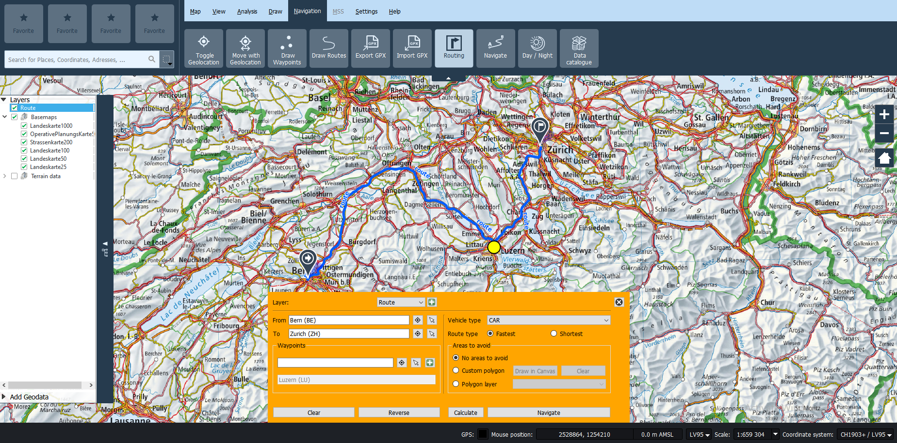
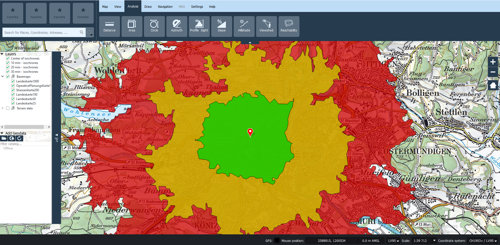

# Routing Plugin


## Installation

These softwares are needed to make the plugin works properly:

1. **KadasLocationSearch**, to enable name based location search. It is usually shipped with Kadas. Without this, you can still choose a location using GPS or click on the map.
2. **Valhalla**, to enable routing, reachability, and navigation functionality. It must be installed in the same machine. Read more about Valhalla [here](https://github.com/valhalla/valhalla).

Currently, the installation only available from this repository.

1. Obtaining the source code

    To get the source code, clone this repository:
	```
    git clone http://github.com/camptocamp/kadas-routing-plugin.git
    ```
    or download the source code using the [Github download link button](https://github.com/camptocamp/kadas-routing-plugin/archive/master.zip).

2. Installation

   To install this plugin on [Kadas Albireo 2](https://github.com/kadas-albireo/kadas-albireo2), extract the zip file from step 1, then copy the `kadasrouting` folder to the KADAS plugins folder located in your used folder. For example:
   ```
   C:\Users\fclementi\AppData\Roaming\Kadas\KadasMil\profiles\default\python\plugins
   ```

3. Enable the plugin

   To enable this plugin, open [Plugin Manager](settings.md#sec5) menu from Settings menu, and tick the checkbox on the Kadas Routing Plugin.

After the plugin has been activated, there will be some additional tool in the Kadas Albiero menu:

1. Routing
2. Navigation
3. Reachability
4. Data Catalogue
5. Day / Night


## Routing

### User Interface

Routing functionality can be accessed from Navigation menu.


Clicking the Routing button will open the Routing window like below.


There are some number indicated in the image above, below are the explanation for each number:

1. **Layer selector** is used to select the output layer from the routing calculation. If there is already a layer, it will be overriden.
2. **Origin point selector** is used to select the origin point for routing calculation. The user can choose by typing a place name, and pop up will be shown up where user can choose based on his typing. The user can also click a location in the map by using the map tool (arrow button) or get the current GPS location (GPS button). A selected point is shown as a pin with an arrow inside it.
3. **Destination point selector** is used to select the destination for routing calculation. The workflow is same as the *origin point selector.* The selected point is shown as a grey pin with a flag inside it.
4. **Way point selector** is used to select a way point for routing calculation. The workflow is same as the *origin point selector*. A way point is shown as a grey pin with a circle inside it.
5. **Way point add button** is used to add the way point from *way point selector* to the list of way points. All selected way points are shown as a yellow circle.
6. **Selected way points** is used to show the list of way point that have been added by *way point add button*
7. **Clear button** is used to clear all selected origin point, destination point, and way points.
8. **Reverse button** is used to reverse the origin and destination point. It will also reverse the order of selected way points.
9. **Vehicle type selector** is used to choose the type of vehicle for the routing calculation.
10. **Route type selector** is used to choose what kind of route that want to be calculated. It can be shortest route or fastest route.
11. **Area to avoid selector** is used to select polygon that will be avoided during the route calculation. It can be created by drawing on the map canvas or from an external polygon layer.
12. **Calculate button** is used to start the routing calculation.
13. **Navigate button** is used to start the navigation based on the calculated route. This button is disabled until a route is calculated.
14. **Close button** is used to close the button

### Route calculation workflow

Here is the steps of common route calculation workflow:

1. Choose a layer from the *layer selector* combo box. It will overwrite an existing routing layer with the same name. It is also possible to use different layer by clicking the plus button and set a new layer name.
2. Choose the origin or starting location by using the *origin point selector*. It can be done by searching the place name, getting the location from a GPS, or clicking on the map by using the map tool (arrow button).
3. Choose the destination location by using the *destination point selector*. It can be done by searching the place name, getting the location from a GPS, or clicking on the map by using the map tool (arrow button).
4. Choose a way point candidate by using the *way point selector*. A way point must be added to the selected way point list by using the *way point add button*. The selected way points are listed on the *selected way points* field. Only the way point listed here are considered on the routing calculation.
5. If a user want to clear up all the selected origin, destination, and way point; he/she can use the *clear button*.
6. If a user want to reverse the order of origin point and destination location, he/she can use the *reverse button*.
7. Choose the mean of transport. See the [Vehicles](#Vehicles) for more information about the available options.
8. Choose the routing calculation method, fastest or shortest.
9. Select the area to be avoided. It can be done by drawing a polygon (custom polygon option) or using an existing layer (polygon layer option).
10. Click calculate button to start the calculation.

Here is an example for a route calculation from *Bern* to *Zurich* through *Luzern*. *Oftringen* is not yet added to selected way point.


### Route calculation result

Here is an example for a route calculation from *Bern* to *Zurich* through *Luzern* by using car and fastest route calculation.



The route calculation will create one layer with the name as selected (e.g. route). This a line layer that contains a routing and step by step navigation information. User can also hover on the result layer to see the length and the elapsed time to go through the route.


## Navigation

## Reachability

### User Interface

The reachability fuctionality can be accessed from the *Anaylisis* menu.


Clicking the Routing button will show a blue cross in the center of the map and the Reachability window as the following:


There are some number indicated in the image above, below are the explanation for each number:

1. **Center Cross** is used to show where is the origin point of the isochrone/isodistance. This center cross can be changed by:

   1. pan the map
   2. using the location tool on no 2 (search by location, GPS, and click on the map).

   This center center cross will always showing the center of the map.

2. **Origin Point Selector** is used to choose the origin point of the isochrone/isodistance. User can use several methods:
   1. Search the location by typing its name
   2. Get the location from the GPS by clicking the GPS button
   3. Using map tool (arrow button) and click on the map.

   Whenever the location is changed, the map also will be recentered and put the blue cross in the center of the map.
3. **Mode Selector** is used to choose between Isochrone or Isodistance.
4. **Transport Method Selector** is used to select the transportation method used for the reachability analysis.
5. **Basename Field** is used to set the basename (prefix) for the result layer.
6. **Interval Fields** is used to specify the interval for the reachability analysis. For isochrone the unit is minutes and for isodistance the unit is km. The interval is separated by a semicolon.
7. **Remove Previous Isoline** check box is used to remove the previous result from the reachability analysis.
8. **Calculate Button** is used to run the reachability analysis
9. **Close Button** is used to close the reachability analysis dialog. It will also hide the *Center Cross*.

### Reachability workflow

Here are the steps to calculate a reachability from a point:

1. Choose a location as the origin for the reachability calculation. It can be done by searching the place name, getting the location from a GPS, clicking on the map by using the map tool, or pan the map and use the center of the map.
2. Choose the reachability calculation method, isochrone or isodistance.
3. Choose the mean of transport. See the [Vehicles](#Vehicles) for more information about the available options.
4. Set the basename for the result layer.
5. Set the intervals for the reachability calculation. Isochrone uses minutes as the interval unit while isodistance use kilometers (km) as the interval unit. It accept integer number for isochrone and float/decimal number for isodistance. Use semicolon to separate each interval.
6. Check the remove previous isoline checkbox if you want to remove.
7. Click calculate button to start the reachability calculation

### Reachability Result

An example of reachabiity result is shown in the following image



The Routing Plugin will creates several polygon layers based on the number of intervals set in the reachability calculation. The layer naming format is [interval][unit] - [basename], in the example above is *10 min - isochrones*, *20 min - isochones*, and *30 min isochrones*. Each layer indicates the area that can be reached based on the interval, e.g. 10 minutes from the center.

## Data Catalogue

### User Interface

The data catalouge fuctionality can be accessed from the *Navigation* menu.


Clicking on the data catalogue menu will open the following data catalogue dialog.


There are some number indicated in the image above, below are the explanation for each number:

1. **List of available tiles data**. User can choose by clicking one of them. It will be used in the calculation by the plugin
2. **Remove/Install/Update button** is used to remove, install, or update the coresponding tiles data. There are 3 possibilities for this button:
    1. *Install* is shown when there is a tile data that is available in the server but not yet available locally. User can install/download the tile data by using this *install* button.
    2. *Remove* is shown when the tile data is already available locally. User can remove the tile data from the file system by using this *remove* button.
    3. *Update* is shown when the tile data on the server is newer than the tile data in the local file system. User can update the tile data by using this *update* button
3. *Close button* is used to close the dialog. The last selected tile data will be used by the plugin

### Data Catalogue Workflow

By default, the plugin will use the tile data provided by the Valhalla installation. User can change the active tile data by using this feature. When the user open the data catalogue menu, it will retrieve the list of tile data on the server. From this list, user can download the tile data and use it for their calculation.

## Day / Night

## Vehicles

Below is the list of supported mean of transport:

1. Walk
2. Car