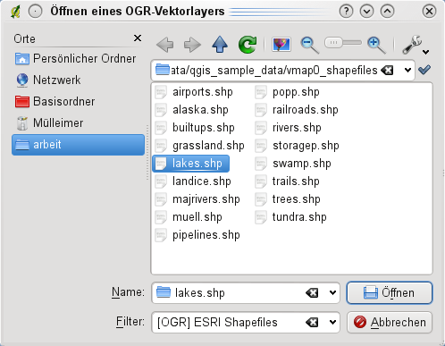

# Supported Data Formats {#supported-data-formats}

KADAS uses the OGR library to read and write vector data formats, including ESRI shapefiles, MapInfo and MicroStation file formats, AutoCAD DXF, PostGIS, SpatiaLite, Oracle Spatial and MSSQL Spatial databases, and many more. GRASS vector and PostgreSQL support is supplied by native KADAS data provider plugins. Vector data can also be loaded in read mode from zip and gzip archives into KADAS. As of the date of this document, 69 vector formats are supported by the OGR library (see OGR-SOFTWARE-SUITE in *literature\_and\_web*). The complete list is available at <a href="http://www.gdal.org/ogr/ogr_formats.html" class="uri" class="reference external">http://www.gdal.org/ogr/ogr_formats.html</a>.

## ESRI Shapefiles {#esri-shapefiles}

The standard vector file format used in KADAS is the ESRI shapefile. Support is provided by the OGR Simple Feature Library (<a href="http://www.gdal.org/ogr/" class="uri" class="reference external">http://www.gdal.org/ogr/</a>).

A shapefile actually consists of several files. The following three are required:

1.  `.shp` file containing the feature geometries
2.  `.dbf` file containing the attributes in dBase format
3.  `.shx` index file

Shapefiles also can include a file with a `.prj` suffix, which contains the projection information. While it is very useful to have a projection file, it is not mandatory. A shapefile dataset can contain additional files. For further details, see the ESRI technical specification at <a href="http://www.esri.com/library/whitepapers/pdfs/shapefile.pdf" class="uri" class="reference external">http://www.esri.com/library/whitepapers/pdfs/shapefile.pdf</a>.

### Loading a Shapefile {#loading-a-shapefile}

When loading a vector layer, the following dialog opens:

**Figure Vector 1:**

Add Vector Layer Dialog 

From the available options check  *File*. Click on **\[Browse\]**. That will bring up a standard open file dialog (see <a href="#figure-vector-2" class="reference internal">figure_vector_2</a>), which allows you to navigate the file system and load a shapefile or other supported data source. The selection box *Filter*  allows you to preselect some OGR-supported file formats.

You can also select the encoding for the shapefile if desired.

**Figure Vector 2:**

Open an OGR Supported Vector Layer Dialog 

Selecting a shapefile from the list and clicking **\[Open\]** loads it into KADAS.

Tip

**Layer Colors**

When you add a layer to the map, it is assigned a random color. When adding more than one layer at a time, different colors are assigned to each layer.

Once a shapefile is loaded, you can zoom around it using the map navigation tools. To change the style of a layer, open the *Layer Properties* dialog by double clicking on the layer name or by right-clicking on the name in the legend and choosing *Properties* from the context menu. See section <a href="vector_properties.html#vector-style-menu" class="reference internal"><em>Style Menu</em></a> for more information on setting symbology of vector layers.

### Improving Performance for Shapefiles {#improving-performance-for-shapefiles}

To improve the performance of drawing a shapefile, you can create a spatial index. A spatial index will improve the speed of both zooming and panning. Spatial indexes used by KADAS have a `.qix` extension.

Use these steps to create the index:

-   Load a shapefile by clicking on the  Add\\ Vector\\ Layer toolbar button or pressing `Ctrl+Shift+V`.
-   Open the *Layer Properties* dialog by double-clicking on the shapefile name in the legend or by right-clicking and choosing *Properties* from the context menu.
-   In the *General* tab, click the **\[Create Spatial Index\]** button.

### Problem loading a shape .prj file {#problem-loading-a-shape-prj-file}

If you load a shapefile with a `.prj` file and KADAS is not able to read the coordinate reference system from that file, you will need to define the proper projection manually within the *General* tab of the *Layer Properties* dialog of the layer by clicking the **\[Specify...\]** button. This is due to the fact that `.prj` files often do not provide the complete projection parameters as used in KADAS and listed in the *CRS* dialog.

For the same reason, if you create a new shapefile with KADAS, two different projection files are created: a `.prj` file with limited projection parameters, compatible with ESRI software, and a `.qpj` file, providing the complete parameters of the used CRS. Whenever KADAS finds a `.qpj` file, it will be used instead of the `.prj`.

## Loading a MapInfo Layer {#loading-a-mapinfo-layer}

 To load a MapInfo layer, change the file type filter *Files of type* : to ‘Mapinfo File \[OGR\] (\*.mif \*.tab \*.MIF \*.TAB)’ and select the MapInfo layer you want to load.

## Loading an ArcInfo Binary Coverage {#loading-an-arcinfo-binary-coverage}

 To load an ArcInfo Binary Coverage, select  *Directory* as *Source type*. Change the file type filter *Files of type*  to ‘Arc/Info Binary Coverage’. Navigate to the directory that contains the coverage file, and select it.

Similarly, you can load directory-based vector files in the UK National Transfer Format, as well as the raw TIGER Format of the US Census Bureau.

