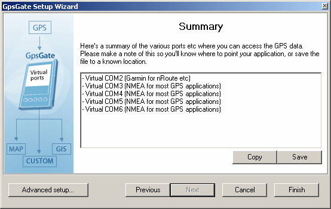

# GpsGate 

## Run GpsGate 

Vous pouvez lancer GpsGate sous *Start&rarr;Programs&rarr;KADAS&rarr;GpsGate*.

La première fois que GpsGate est lancé, un assistant d'installation démarre. L'assistant vous aidera à trouver votre GPS et vous indiquera comment connecter vos applications GPS à GpsGate.

## Exécution de l'assistant d'installation 

Assurez-vous que vous allumez votre GPS, et connectez-le à votre ordinateur, s'il s'agit d'un GPS Bluetooth sans fil, allumez-le simplement. Pour accélérer la recherche, vous pouvez décocher les types de récepteurs GPS que vous ne souhaitez pas rechercher. Si vous n'êtes pas certain, cochez toutes les options. Ensuite, cliquez sur "Suivant" et l'Assistant scanne votre ordinateur à la recherche d'un GPS connecté.

Si vous êtes un utilisateur avancé, cliquez sur "Advanced setup..." pour un processus d'installation où vous avez un contrôle total. Vous pouvez toujours exécuter à nouveau l'Assistant à partir de la boîte de dialogue Paramètres.

Cliquez sur Suivant. L'Assistant va maintenant commencer à rechercher un GPS. Cela peut prendre un certain temps.

Lorsque l'Assistant trouve un GPS, une boîte de dialogue de message s'affiche. Cliquez sur "Oui" pour accepter le GPS trouvé comme entrée. Si plusieurs récepteurs GPS sont connectés, cliquez sur "Non" jusqu'à ce que GpsGate trouve le récepteur que vous souhaitez utiliser.

Si GpsGate ne trouve pas votre GPS, vous devez utiliser "Advanced Setup..."

Sélectionnez Sortie et cliquez sur "Suivant". En cas de doute, cliquez simplement sur "Suivant".

L'écran suivant affiche un résumé. Il est important de sauvegarder ce résumé. Vous pouvez l'enregistrer dans un fichier et l'imprimer. Vous trouverez également ces informations plus tard dans la boîte de dialogue Paramètres (dans le menu Plateau).

Vous connectez les applications Garmin comme nRoute au premier port de la liste, et les autres applications NMEA aux autres ports. Vous ne pouvez connecter qu'une seule application à un seul port à la fois. Si vous avez besoin de créer d'autres ports, vous pouvez le faire à partir de la boîte de dialogue Paramètres à tout moment.

Vous pouvez maintenant démarrer vos applications GPS et les connecter aux ports créés par GpsGate dans la dernière étape ci-dessus. Vous pouvez exécuter toutes les applications GPS en même temps !

Lorsque GpsGate est en cours d'exécution, il s'affiche sous la forme d'une icône de plateau. En cliquant sur cette icône, vous pouvez accéder à ses fonctions.

Vous pouvez réexécuter l'Assistant à tout moment en cliquant sur "Assistant d'installation..." dans la boîte de dialogue Paramètres. Couleurs et formes des icônes des plateaux

L'icône de la barre d'état indique toujours l'état de GpsGate. Voici une liste des icônes possibles affichées dans la barre d'état-major :

Aucune donnée GPS ou NMEA n'est détectée par GpsGate.

Des données GPS valides ont été détectées à l'entrée sélectionnée, mais les données GPS n'ont pas de position, c'est-à-dire qu'elles ne peuvent pas (encore) déterminer leur position.

! 
Une position GPS valide (position) a été détectée à l'entrée sélectionnée.

Si l'icône de la barre d'état n'est pas verte, votre application GPS n'affichera pas/n'utilisera pas une position correcte.
