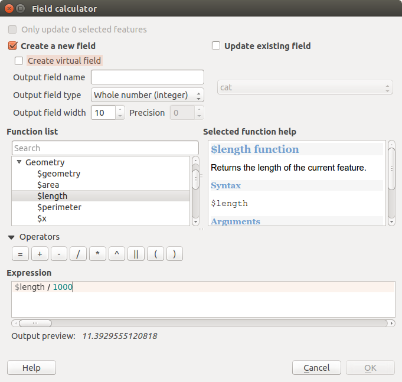

# Calcolatore di campi 

Il pulsante *Calcolatore di campi*  nella tabella degli attributi consente di eseguire calcoli sulla base dei valori degli attributi esistenti o di funzioni definite, ad esempio, per calcolare la lunghezza o l'area degli elementi geometrici. I risultati possono essere scritti in un nuovo campo attributo, un campo virtuale, oppure possono essere usati per aggiornare i valori in un campo esistente.

**Campi virtuali**

-   Campi virtuali non sono permanenti e non sono salvati.
-   Un campo deve essere definito virtuale al momento della sua creazione.

Il calcolatore di campo è disponibile su qualsiasi livello che supporti la modifica. Quando si fa clic sull'icona della calcolatrice di campo, si apre la finestra di dialogo. Se il livello non è in modalità di modifica, viene visualizzato un avviso e l'utilizzo del calcolatore di campo farà sì che il livello venga messo in modalità di modifica prima di effettuare il calcolo.

La barra di calcolo rapido del campo in cima alla tabella degli attributi è visibile solo se il livello è modificabile.

Nella barra di calcolo rapido del campo, selezionate prima il nome del campo esistente, quindi aprite la finestra di dialogo dell'espressione per creare la vostra espressione o scriverla direttamente nel campo, quindi cliccate sul pulsante **Aggiorna tutto**.

## Scheda espressioni 

Nella finestra di dialogo del campo calcolatrice, è necessario prima di tutto selezionare se si desidera aggiornare solo le caratteristiche selezionate, creare un nuovo campo attributo in cui verranno aggiunti i risultati del calcolo o aggiornare un campo esistente.

Per aggiungere un nuovo campo devi creare il nome, il tipo di campo (intero, decimale, testo) e la lunghezza del campo. Per il tipo Numero decimale puoi anche definire la precisione, ovvero il numero di cifre dopo la virgola: ad esempio un campo con larghezza 10 e precisione 3 avrà 6 cifre prima della virgola, la virgola stessa è un campo ed infine 3 cifre decimali (vedi <a href="#figure-attributes-3">figure_attributes_3</a>).

Un breve esempio illustra come funziona il calcolatore di campo quando si utilizza la scheda *Espressione*. Vogliamo calcolare la lunghezza in km del livello `ferrovie` dal dataset del campione KADAS:

1.  Carica lo shapefile `railroads.shp` e clicca su  *Apri tabella attributi*.

2.  Attiva la modalità  *Modifica* e apri il  *Calcolatore di campi*.

3.  Spunta la casella di controllo  *Crea un nuovo campo* per attivare la creazione di un nuovo campo.

4.  Chiama il campo `length`, imposta `Numero decimale (real)` come tipo, 10 come larghezza e 3 come precisione.

5.  Ora fai doppio click sulla funzione `$length` presente nel gruppo *Geometria* per aggiungerla nella sezione **Espressione**.

6.  Completa l’espressione digitando ‘’/ 1000’’ nel campo Espressione e clicca **\[OK\]**.

7.  You can now find a new field `length` in the attribute table.

Le funzioni disponibili sono elencate nel capitolo [Espressioni](expression.md).

## Scheda Editor funzioni 

Con il l'editor funzioni è possibile definire le proprie funzioni personalizzate Python in modo confortevole. L'editor di funzioni creerà nuovi file Python in `qgis2pythonexpressions` e caricherà automaticamente tutte le funzioni definite all'avvio di KADAS. Nota che le nuove funzioni vengono salvate solo nella cartella `espressioni` e non nel file di progetto. Se hai un progetto che utilizza una delle tue funzioni personalizzate, dovrai anche condividere il file .py nella cartella delle espressioni.

Ecco un breve esempio su come creare le proprie funzioni:

    @qgsfunction(args="auto", group='Custom')
    def myfunc(value1, value2 feature, parent):
        pass

L'esempio breve crea una funzione 'myfunc' che vi darà una funzione con due valori. Quando si usa l'argomento della funzione args='auto' il numero di argomenti della funzione richiesti sarà calcolato dal numero di argomenti con cui la funzione è stata definita in Python (meno 2 - feature, e parent).

Questa funzione può quindi essere usata con la seguente espressione:

    myfunc('test1', 'test2')

La funzione sarà implementata nella scheda *Funzioni* Personalizzate della scheda *Espressione* dopo aver utilizzato il pulsante *Esegui Script*.

Ulteriori informazioni sulla creazione del codice Python possono essere trovate su <a href="http://www.qgis.org/html/en/docs/pyqgis_developer_cookbook/index.html">http://www.qgis.org/html/en/docs/pyqgis_developer_cookbook/index.html</a>.

L'editor di funzioni non si limita a lavorare con il calcolatore di campo, ma si può trovare ogni volta che si lavora con le espressioni.

